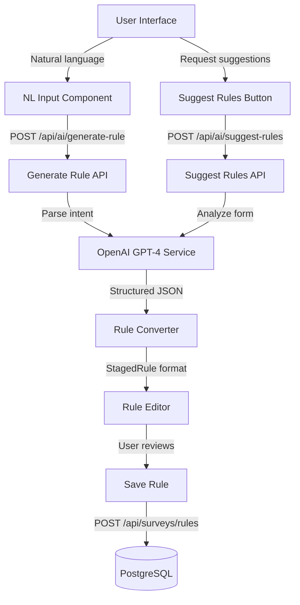

# AI-Based Validation Rule Builder

## Architecture Overview




## Implementation Components

### 1. Backend: OpenAI Service

**New file:** `[backend/services/ai_service.py](backend/services/ai_service.py)`

Core service for OpenAI API integration:

- Initialize OpenAI client with API key from environment
- Implement `generate_rule_from_text(prompt: str, kobo_variables: List[str])` - converts natural language to rule structure
- Implement `suggest_rules(kobo_form: KoboFormStructure)` - analyzes form and suggests relevant validation rules
- Use structured output format (OpenAI function calling or JSON mode) to ensure valid responses
- Handle rate limits, errors, and timeouts gracefully

**Key patterns to detect:**

- Duration checks: "under X minutes", "longer than Y"
- Range checks: "between X and Y", "greater than", "less than"
- Date checks: "before date", "after date", "on weekends"
- Logical conditions: "if A then B", "when X is Y"
- Multiple conditions: "and", "or" operators

**Example prompt structure:**

```text
Given these variables from a survey form:
- age (integer)
- consent (select_one: yes/no)
- income (integer)

Convert this rule: "Flag if respondent is under 18"

Return JSON: {
  "description": "...",
  "issue_message": "...",
  "conditions": [{"variable": "age", "operator": "<", "value": "18", "valueType": "static"}]
}
```

### 2. Backend: API Endpoints

**File:** `[backend/routers/ai.py](backend/routers/ai.py)` (new router)

#### Endpoint 1: Generate Rule from Natural Language

```python
@router.post("/ai/generate-rule")
async def generate_rule_from_natural_language(
    survey_id: str,
    prompt: str,
    db: Session = Depends(get_db),
    current_user: User = Depends(get_current_active_user)
):
    # 1. Verify user has access to survey
    # 2. Fetch survey config and extract variable names/types
    # 3. Call ai_service.generate_rule_from_text()
    # 4. Validate generated rule structure
    # 5. Return StagedRule format for frontend
```

#### Endpoint 2: Suggest Rules Based on Form

```python
@router.post("/ai/suggest-rules")
async def suggest_validation_rules(
    survey_id: str,
    db: Session = Depends(get_db),
    current_user: User = Depends(get_current_active_user)
):
    # 1. Verify user has access to survey
    # 2. Fetch survey config and Kobo form structure
    # 3. Extract variable types, constraints from Kobo tool
    # 4. Call ai_service.suggest_rules()
    # 5. Return array of suggested StagedRules
```

**Register router in** `[backend/main.py](backend/main.py)`:

```python
from routers import ai
app.include_router(ai.router, prefix="/api", tags=["ai"])
```

### 3. Frontend: Natural Language Input UI

**File:** `[frontend/pages/RuleBuilder.tsx](frontend/pages/RuleBuilder.tsx)`

Add new section before Step 3 (Rule Editor):

```tsx
<section className="p-6 bg-gray-100 dark:bg-gray-850 rounded-lg border">
  <h2 className="text-xl font-bold mb-4">✨ AI Rule Builder</h2>
  <p className="text-gray-600 dark:text-gray-400 mb-4">
    Describe your rule in plain English, and AI will convert it to a validation rule.
  </p>
  
  <div className="space-y-3">
    <textarea 
      value={naturalLanguageInput}
      onChange={(e) => setNaturalLanguageInput(e.target.value)}
      placeholder="Example: Flag any survey completed in under 10 minutes"
      className="w-full h-24 px-3 py-2 border rounded-md"
    />
    
    <button onClick={handleGenerateRule} disabled={isGenerating}>
      {isGenerating ? 'Generating...' : 'Generate Rule'}
    </button>
    
    {aiGeneratedRule && (
      <div className="bg-blue-50 dark:bg-blue-900/20 p-4 rounded-md">
        <p className="font-semibold mb-2">Generated Rule:</p>
        <RulePreview rule={aiGeneratedRule} />
        <button onClick={() => acceptGeneratedRule(aiGeneratedRule)}>
          Accept & Add to Editor
        </button>
      </div>
    )}
  </div>
</section>
```

**Component:** `[frontend/components/rule-builder/AINaturalLanguageInput.tsx](frontend/components/rule-builder/AINaturalLanguageInput.tsx)` (new)

Separate component for cleaner code:

- Textarea for natural language input
- Loading state during API call
- Preview of generated rule
- Accept/Reject buttons
- Error handling and retry mechanism

### 4. Frontend: AI Suggestions Feature

**Component:** `[frontend/components/rule-builder/AISuggestedRules.tsx](frontend/components/rule-builder/AISuggestedRules.tsx)` (new)

Display in right sidebar below "Staged Rules":

```tsx
<section className="p-6 bg-gray-100 dark:bg-gray-850 rounded-lg border">
  <h2 className="text-xl font-bold mb-4">💡 AI Suggestions</h2>
  <button onClick={handleGetSuggestions} disabled={isLoadingSuggestions}>
    Analyze Form & Suggest Rules
  </button>
  
  {suggestions.map(suggestion => (
    <div key={suggestion.id} className="mt-3 p-3 bg-white rounded border">
      <p className="font-medium">{suggestion.description}</p>
      <p className="text-sm text-gray-600">{suggestion.issue_message}</p>
      <button onClick={() => addSuggestionToEditor(suggestion)}>
        Add to Editor
      </button>
    </div>
  ))}
</section>
```

Features:

- Button to trigger AI analysis of current Kobo form
- Display 5-10 suggested rules based on form structure
- Each suggestion shows description, issue message, and conditions
- "Add to Editor" button to populate RuleEditor with suggestion
- "Add All" button to bulk-add multiple suggestions

### 5. API Service Layer

**File:** `[frontend/services/aiApi.ts](frontend/services/aiApi.ts)` (new)

```typescript
export async function generateRuleFromNaturalLanguage(
  surveyId: string,
  prompt: string
): Promise<StagedRule> {
  const response = await fetch(`/api/ai/generate-rule`, {
    method: 'POST',
    body: JSON.stringify({ survey_id: surveyId, prompt }),
    headers: { 'Content-Type': 'application/json' }
  });
  return await response.json();
}

export async function getSuggestedRules(
  surveyId: string
): Promise<StagedRule[]> {
  const response = await fetch(`/api/ai/suggest-rules`, {
    method: 'POST',
    body: JSON.stringify({ survey_id: surveyId }),
    headers: { 'Content-Type': 'application/json' }
  });
  return await response.json();
}
```

### 6. Environment Configuration

**File:** `[.env.example](.env.example)`

Add:

```bash
# OpenAI Configuration
OPENAI_API_KEY=sk-your-openai-api-key-here
OPENAI_MODEL=gpt-4o-mini  # Cost-effective, or use gpt-4o for better accuracy
OPENAI_MAX_TOKENS=1000
OPENAI_TEMPERATURE=0.2  # Low temperature for consistent structured outputs
```

### 7. Error Handling & User Experience

**Key considerations:**

- Show clear error messages if OpenAI API fails (API key missing, rate limit, timeout)
- Provide example prompts to guide users
- Allow editing of generated rules before accepting
- Cache suggestions per survey to avoid repeated API calls
- Add "Clear" button to reset AI input
- Show token/cost estimates if applicable

### 8. Testing

**File:** `[backend/tests/test_ai_service.py](backend/tests/test_ai_service.py)` (new)

Test cases:

- Test rule generation with various natural language inputs
- Test handling of invalid/ambiguous prompts
- Test suggestion generation for different form types
- Mock OpenAI API responses for consistent testing
- Test error handling (API failures, timeouts)

**File:** `[backend/tests/test_ai_endpoints.py](backend/tests/test_ai_endpoints.py)` (new)

Test cases:

- Test `/api/ai/generate-rule` endpoint with valid/invalid inputs
- Test `/api/ai/suggest-rules` endpoint
- Test authentication and permissions
- Test with missing API key

## Data Flow

### Rule Generation Flow

1. User types: "Flag if age is greater than 100"
2. Frontend calls `POST /api/ai/generate-rule` with prompt + survey_id
3. Backend fetches Kobo form variables from survey config
4. Backend calls OpenAI with structured prompt
5. OpenAI returns JSON: `{description, issue_message, conditions: [{variable, operator, value, valueType}]}`
6. Backend validates and returns StagedRule format
7. Frontend displays preview in UI
8. User reviews and clicks "Accept"
9. Rule populates into RuleEditor component
10. User can modify and save to database

### Suggestions Flow

1. User clicks "Analyze Form & Suggest Rules"
2. Frontend calls `POST /api/ai/suggest-rules` with survey_id
3. Backend fetches full Kobo form structure (variables, types, constraints)
4. Backend builds analysis prompt with form metadata
5. OpenAI analyzes form and suggests 5-10 relevant rules
6. Backend returns array of StagedRules
7. Frontend displays as cards with "Add to Editor" buttons
8. User selects which suggestions to add

## Prompt Engineering Strategy

### Generation Prompt Template

```
You are a data quality validation expert. Convert the following rule description into a structured validation rule.

Survey Variables:
- age: integer (respondent age)
- consent: select_one (yes, no)
- income: integer (monthly income)

User Request: "Flag if respondent is under 18 or didn't give consent"

Return JSON matching this schema:
{
  "description": "Short name for the rule",
  "issue_message": "Message shown when rule triggers",
  "conditions": [
    {"variable": "age", "operator": "<", "value": "18", "valueType": "static"},
    {"joiner": "|"},
    {"variable": "consent", "operator": "!=", "value": "yes", "valueType": "static"}
  ]
}

Supported operators: ==, !=, >, <, >=, <=, %in%
For %in%, use comma-separated values in the value field.
```

### Suggestions Prompt Template

```
You are a data quality expert reviewing a survey form. Suggest 5-10 validation rules.

Form Structure:
- age: integer (0-120 expected)
- consent: select_one (yes/no)
- interview_duration: decimal (minutes)
- household_size: integer

Suggest rules for:
1. Range validation (age, household_size)
2. Required field checks (consent)
3. Duration anomalies (too short/long)
4. Logical consistency (if age < 18, check guardian consent)

Return JSON array of rules using the schema above.
```

## Integration Points

**Existing components to modify:**

- `[frontend/pages/RuleBuilder.tsx](frontend/pages/RuleBuilder.tsx)` - Add AI sections
- `[frontend/components/rule-builder/RuleEditor.tsx](frontend/components/rule-builder/RuleEditor.tsx)` - Accept pre-populated rules from AI
- `[backend/main.py](backend/main.py)` - Register AI router
- `[.env.example](.env.example)` - Add OpenAI config

**Existing utilities to reuse:**

- `[frontend/utils/ruleConverter.ts](frontend/utils/ruleConverter.ts)` - Validate AI-generated rules
- `[backend/etl/hfc_engine.py](backend/etl/hfc_engine.py)` - Understand rule evaluation context

## Cost Management

OpenAI API costs:

- gpt-4o-mini: ~$0.15 per 1M input tokens, ~$0.60 per 1M output tokens
- Estimated cost per rule generation: $0.001-0.002
- Estimated cost per suggestion request: $0.003-0.005
- Monthly cost for 1000 rules/suggestions: ~$3-5

**Optimization strategies:**

- Use gpt-4o-mini for cost-effectiveness
- Cache suggestions per survey (TTL: 1 hour)
- Set max_tokens limit to prevent runaway costs
- Add rate limiting per user if needed

## Security Considerations

- Store OpenAI API key in environment variable only (never in database)
- Sanitize user input before sending to OpenAI
- Don't send sensitive submission data to OpenAI (only form structure/metadata)
- Add request timeout (30 seconds)
- Log API usage for monitoring
- Validate all AI-generated rules before accepting

## Dependencies

Add to `[backend/requirements.txt](backend/requirements.txt)`:

```
openai==1.54.0  # Official OpenAI Python client
```

Frontend has no new dependencies (uses native fetch API).

## User Documentation

Add help text/tooltips:

- "Describe your rule in plain English. Example: Flag if age is greater than 100"
- "The AI will generate a rule based on your survey's variables"
- "You can edit the generated rule before saving"
- "Click 'Analyze Form' to get AI-suggested rules for common validation scenarios"

